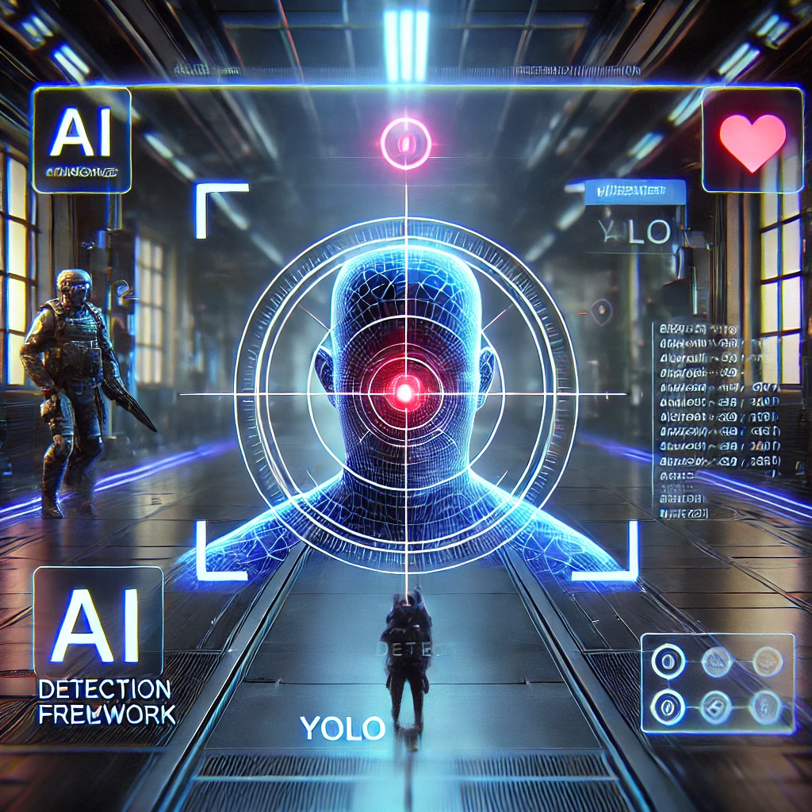

# 🎯 YOLO AI 電腦畫面偵測與滑鼠控制

## 📌 專案介紹

本專案使用 YOLOv8 即時偵測遊戲畫面中的敵人，並透過 滑鼠自動瞄準與開槍。
支援 Arduino 硬體控制，可使用快捷鍵啟動或停用輔助功能。

---

## 🚀 功能特色

✅ YOLOv8 即時偵測：從遊戲畫面擷取敵人位置  
✅ 滑鼠自動瞄準：精準對準敵人頭部  
✅ 自動開槍（可選）  
✅ 快捷鍵開關（F1：Aimbot、F2：Auto-fire）  
✅ 支援 Arduino 硬體控制  
✅ PyQt UI 介面（調整靈敏度、模式開關）

---

## 💻 系統需求

### 📌 硬體

- Windows / Linux / macOS
- NVIDIA GPU（建議）
- Arduino（可選）

### 📌 軟體

- Python 3.8+
- YOLOv8（Ultralytics）
- MSS（螢幕擷取）
- PyAutoGUI / Pynput（滑鼠控制）
- PyQt5（UI 介面）

---

## 🔧 安裝與執行

### 📌 1️⃣ 安裝依賴

pip install -r requirements.txt

